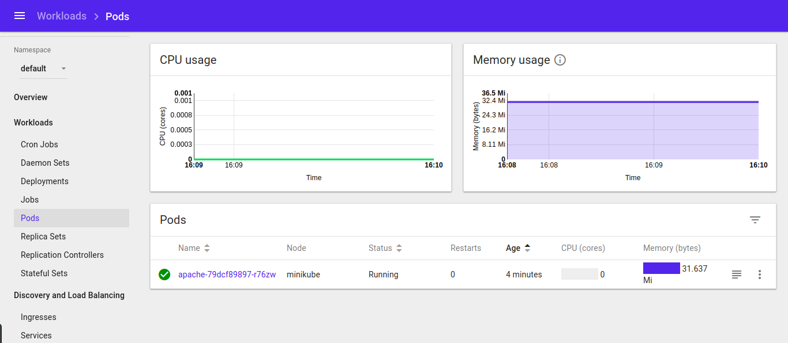
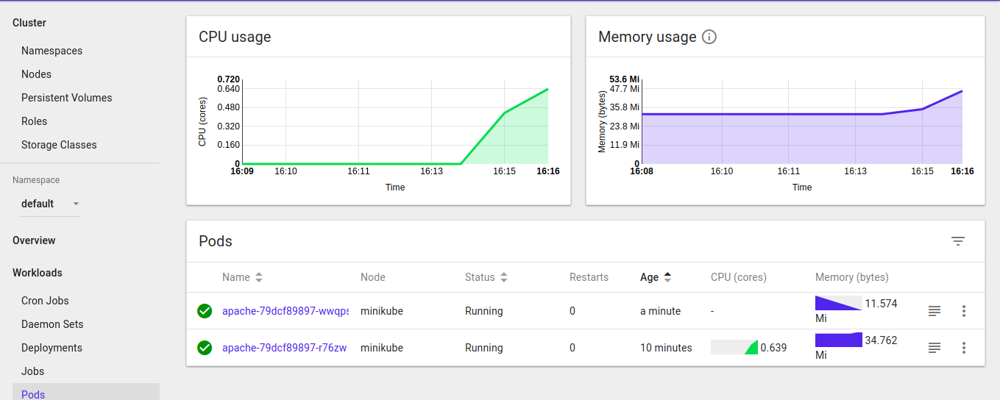
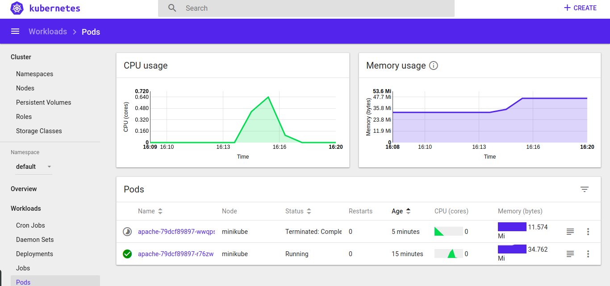
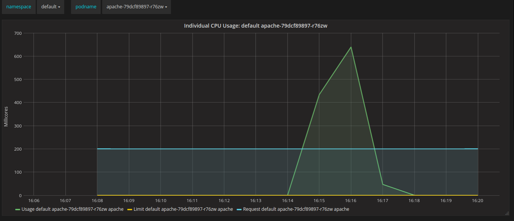

# Overview
This is an automated tutorial instructing hot to use Kubernetes to achieve horizontal auto-scaling. The technology stack heavily involves Ansible, Kubernetes, Docker etc. For simplicity, we will first use Minikube to demonstrate the power of Kubernetes on local machine.

## Minimum Requirement
For the best user experience, please prepare:
* Ubuntu (v16.04.2)
* Ansible (v2.3.2)

## Ansible Roles
There are some packages that will be automatically installed, some with a fixed stable version.
* docker-ce (*for reference v17.06* )
* virtualbox (*for reference v5.1*)
* minikube (**fixed v0.24.1**)
* kubernetes (**fixed v1.8.5**)

## Command Line Tool
There is a `operate.sh` provided to operate the Ansible playbook. Here is the example usage
`
Usage: ./operate.sh {play|try|ping|setup} {playbook}
Always localhost
`
1. Execute a playbook
`./operate.sh  play {playbook-file}`

## Example Summary
Here are some services that Kubernetes assists to scale horizontally to a predefined replication definition based on observed resource utilization.

| Service Name         | Resource Type    | Resource Threshold | Replication (From -> To)  |  Note    |
| ---------------------|:----------------:| :----------------: | :-----------:| :------:   |
| Official PHP Apache  | CPU              | 50%                |  1 -> 2      |            |

### Official PHP Apache Server
1. Start Apache Playbook :
`./operate.sh play official-php-apache-autoscaler-playbook.yml`
You will see Official PHP Apache service / pod launched as below 

2. Start Official PHP Apache DDOS Playbook:
`./operate.sh play official-php-apache-ddos-playbook.yml`
After a few minutes, we will CPU consumption has increased. As a results, the deployment will resize to 2 replicas as predefined.

3. Stop the load by pressing `Ctrl-C`
After a short while, CPU utilization drops to 0. HPA auto-scaler removes one replica.

4. Grafana as Monitor Server
Grafana shows the resource trend as a observability tool.

